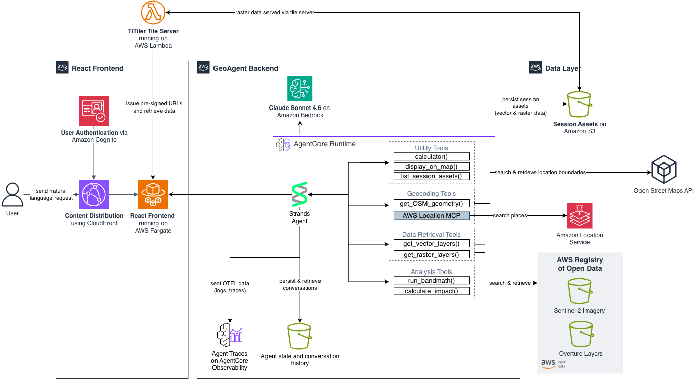

# Geospatial Agent on AWS

An AI agent that analyzes satellite imagery for any location on Earth using natural language. Ask about vegetation health, water bodies, or wildfire damage — get real results from Sentinel-2 imagery, rendered on an interactive map.


**Full deployment: ~15 minutes** | 3 components (agent + tile server + frontend)

## Example Queries

```
"Show vegetation health for Central Park, New York"                              --> NDVI vegetation health map
"Assess wildfire damage near Pacific Palisades, Los Angeles in January 2025"     --> NBR burn severity map
"Compare water levels for Folsom Lake, California 2021 vs 2022"                  --> NDWI water body analysis
"Show vegetation status for Hyde Park, London"                                   --> NDVI with OSM boundary
"Scan Colorado for land change between 2019 and 2024"                            --> LGND embedding change scan
```

## Architecture



| Component | Technology |
|-----------|------------|
| **Agent** | [Strands Agents](https://strandsagents.com/latest/) with Claude Sonnet 4.6 on [Amazon Bedrock AgentCore Runtime](https://aws.amazon.com/bedrock/agentcore/) |
| **Tools** | Sentinel-2 imagery, NDVI/NDWI/NBR analysis, OSM boundaries, Amazon Location Service (MCP) hosted on AgentCore Runtime|
| **UI** | React + TypeScript + MapLibre GL on ECS Fargate behind CloudFront, wt. Cognito auth |

## Project Structure

```
├── geo_agent/           # Core AI agent (Python)
├── api-cdk/             # REST API + MCP endpoint wrapper (CDK) — optional
├── react-ui/            # Web UI (React + Express)
├── frontend-cdk/        # UI infrastructure (CDK)
├── titiler-cdk/         # Tile server (CDK)
└── use-cases/           # Pre-configured scenarios
```

## Prerequisites

1. **AWS CLI** configured with appropriate permissions
2. **Docker** installed and running
3. **Python 3.10+** with pip
4. **Node.js 20+** (`nvm use 20`)
5. **AWS CDK**:
   ```bash
   npm install -g aws-cdk
   ```
6. **AgentCore CLI**:
   ```bash
   pip install bedrock-agentcore==1.1.2 bedrock-agentcore-starter-toolkit==0.3.0
   ```
7. **Bedrock model access** for Claude Sonnet 4.6 in us-east-1 (granted automatically - ensure IAM/SCPs don't restrict it)

> **Note:** All Python dependencies (strands-agents, boto3, geospatial libraries) are handled automatically by Docker during deployment. The AgentCore CLI is only needed for the `agentcore configure` and `agentcore launch` commands.

---

## Deployment Guide

This guide walks through deploying all three components:

1. **Geo Agent** — AgentCore agent with satellite analysis tools (~5 min)
2. **TiTiler** — Satellite imagery tile server (~2 min)
3. **React UI Frontend** — Web interface with authentication (~7 min)
4. **REST API** *(optional)* — API Gateway wrapper for external integrations (~3 min)

### Initial Setup (run once)

Set shell variables used throughout the deployment. These persist for your terminal session:

```bash
# Auto-detect your AWS account ID
export AWS_ACCOUNT=$(aws sts get-caller-identity --query Account --output text)
export AWS_REGION=us-east-1
export S3_BUCKET_NAME=geospatial-agent-on-aws-${AWS_ACCOUNT}

# Verify
echo "Account: $AWS_ACCOUNT | Region: $AWS_REGION | Bucket: $S3_BUCKET_NAME"
```

Bootstrap CDK (first time only):
```bash
cdk bootstrap aws://${AWS_ACCOUNT}/${AWS_REGION}
```

---

## Part 1: Deploy the Geo Agent

### Step 1: Create S3 Bucket

```bash
aws s3 mb s3://${S3_BUCKET_NAME} --region ${AWS_REGION}
```

### Step 2: Create AgentCore Role

```bash
python geo_agent/agentcore_utils/create_cdk_agent_role.py \
  --agent-name geospatial-agent-on-aws \
  --s3-bucket ${S3_BUCKET_NAME}
```

This creates `geospatial-agent-on-aws_role_info.json` locally and the IAM role.

### Step 3: Configure Environment

```bash
cd geo_agent
cp .env.example .env

# Auto-populate required values
sed -i.bak \
  -e "s|AWS_REGION=.*|AWS_REGION=${AWS_REGION}|" \
  -e "s|S3_BUCKET_NAME=.*|S3_BUCKET_NAME=${S3_BUCKET_NAME}|" \
  -e "s|AGENTCORE_ARN=.*|AGENTCORE_ARN=arn:aws:iam::${AWS_ACCOUNT}:role/agentcore-geospatial-agent-on-aws-role|" \
  .env && rm -f .env.bak
```

> **Optional:** Edit `geo_agent/.env` to change `AWS_REGION` or `MODEL_ID`, or to add Langfuse keys.

> **Note:** If you have an existing `.bedrock_agentcore.yaml`, delete or back it up before deploying. The deploy scripts will create a new one.

### Step 4: Deploy Agent

```bash
./deploy.sh
```

> **Optional: Deploy with Langfuse observability** — Sign up at [langfuse.com](https://langfuse.com/), add these to `geo_agent/.env`, then run `./deploy_with_langfuse.sh` instead:
> ```
> LANGFUSE_SECRET_KEY=sk-lf-your-secret-key
> LANGFUSE_PUBLIC_KEY=pk-lf-your-public-key
> LANGFUSE_BASE_URL=https://cloud.langfuse.com
> ```

### Step 5: Deploy Change Detection (optional)

Enables region-wide change scanning using [LGND/Clay](https://source.coop/clay/lgnd-embeddings/) pre-computed embeddings. The Lambda deploys in us-west-2 (co-located with the data).

```bash
cdk bootstrap aws://${AWS_ACCOUNT}/us-west-2
cd ../frontend-cdk
npx cdk deploy ChangeDetectionStack --require-approval never
```

Then set `LGND_EMBEDDINGS_ENABLED=true` in `geo_agent/.env` and redeploy the agent.

```bash
cd ../geo_agent
```

### Step 6: Test Agent (optional)

```bash
agentcore invoke '{"prompt": "Show vegetation health for Central Park, New York"}'
```

Save the Agent Runtime ARN for Part 3:
```bash
export AGENT_RUNTIME_ARN=$(grep agent_arn .bedrock_agentcore.yaml | awk '{print $2}')
echo "Agent ARN: $AGENT_RUNTIME_ARN"
```

```bash
cd ..
```

---

## Part 2: Deploy TiTiler

TiTiler serves satellite imagery tiles for the React UI. This deployment is required for the frontend to display satellite imagery.

```bash
cd titiler-cdk
npm install
npx cdk deploy --require-approval never
```

**Deployment time:** ~2 minutes. Deploys a Lambda-based tile server with API Gateway and API key.

### Grab TiTiler URL and API key from the stack outputs

```bash
TITILER_URL=$(aws cloudformation describe-stacks \
  --stack-name TitilerStack --region ${AWS_REGION} \
  --query 'Stacks[0].Outputs[?OutputKey==`ApiUrl`].OutputValue' --output text)

API_KEY_ID=$(aws cloudformation describe-stacks \
  --stack-name TitilerStack --region ${AWS_REGION} \
  --query 'Stacks[0].Outputs[?OutputKey==`ApiKeyId`].OutputValue' --output text)
TITILER_API_KEY=$(aws apigateway get-api-key \
  --api-key ${API_KEY_ID} --include-value \
  --query 'value' --output text --region ${AWS_REGION})

echo "TiTiler URL: $TITILER_URL"
```

Write these to the frontend `.env` so the React UI can load tiles:

```bash
cat > ../react-ui/frontend/.env << EOF
VITE_TITILER_URL=${TITILER_URL}
VITE_TITILER_API_KEY=${TITILER_API_KEY}
EOF
```

> **Verify (optional):** 

```bash
curl -s -H "x-api-key: ${TITILER_API_KEY}" ${TITILER_URL}healthz
```
> Expected: `{"versions":{"titiler":"0.24.2","rasterio":"1.4.3",...}}`

```bash
cd ..
```

---

## Part 3: Deploy React UI Frontend

### Configure

```bash
cd frontend-cdk
cp .env.example .env

# Set your admin email (receives temporary login password)
export ADMIN_EMAIL=your-email@example.com

# Auto-populate .env from shell variables
sed -i.bak \
  -e "s|AGENT_RUNTIME_ARN=.*|AGENT_RUNTIME_ARN=${AGENT_RUNTIME_ARN}|" \
  -e "s|S3_BUCKET_NAME=.*|S3_BUCKET_NAME=${S3_BUCKET_NAME}|" \
  -e "s|AWS_REGION=.*|AWS_REGION=${AWS_REGION}|" \
  -e "s|ADMIN_EMAIL=.*|ADMIN_EMAIL=${ADMIN_EMAIL}|" \
  .env && rm -f .env.bak
```

### Deploy

```bash
npm install
./deploy.sh -y

# Or if you use finch
./deploy_finch.sh -y
```

**What gets deployed:** VPC, ECS Fargate with auto-scaling, ALB, CloudFront (HTTPS), Cognito auth, WAF.

### First Login

```bash
# Get your application URL
aws cloudformation describe-stacks \
  --stack-name GeospatialAgentStack \
  --query 'Stacks[0].Outputs[?OutputKey==`ApplicationURL`].OutputValue' \
  --output text
```

1. Open the CloudFront URL in your browser
2. Login with your `ADMIN_EMAIL` and temporary password (sent via email)
3. Set a new secure password (min 12 chars, mixed case, numbers, symbols)

### Upload Use Case Scenarios (optional)

```bash
cd ..
aws s3 sync use-cases/ s3://${S3_BUCKET_NAME}/use-cases/
```

### Managing Users

**Add new users:** AWS Console -> Cognito User Pools -> `geospatial-agent-dev` -> Create user

### Monitoring

```bash
# Live tail application logs
aws logs tail /ecs/geospatial-agent-dev --follow --region ${AWS_REGION}

# Run diagnostics
cd frontend-cdk && ./scripts/diagnose.sh
```

### Fast Updates (Code Changes Only)

```bash
# From frontend-cdk directory — rebuilds container only
./scripts/quick-update.sh
```

---

## Part 4: Deploy REST API (Optional)

> **This is optional.** Deploy this if you want external systems (e.g., a data mesh or other services) to call the geospatial agent via a standard REST API instead of invoking AgentCore directly.

The REST API wraps the AgentCore agent behind API Gateway + Lambda with an async job pattern. Consumers submit analysis requests and poll for results — no timeout constraints. Authentication uses API keys.

This deployment also includes an **MCP (Model Context Protocol) endpoint** at `/mcp`, enabling AI agents and data mesh platforms to discover and invoke individual geospatial tools programmatically. See [MCP Endpoint](#mcp-endpoint) below.

**Endpoints:**

| Method | Path | Description |
|--------|------|-------------|
| `POST` | `/analyze` | Submit an analysis job (returns immediately with a job ID) |
| `GET` | `/jobs/{jobId}` | Poll for job status and results |
| `GET` | `/capabilities` | List available analysis types and service metadata |
| `POST` | `/mcp` | MCP JSON-RPC endpoint (initialize, tools/list, tools/call) |

### API Contract

#### POST /analyze

Submits a satellite imagery analysis job. Returns immediately with a job ID.

**Request:**

```json
{
  "location": "Central Park, New York",
  "analysisType": "NDVI",
  "dateRange": {
    "start": "2025-01-01",
    "end": "2025-01-31"
  }
}
```

| Field | Type | Required | Description |
|-------|------|----------|-------------|
| `location` | string | yes | Location name or coordinates (e.g. `"Central Park, New York"` or `"41.37, 21.97"`) |
| `analysisType` | string | yes | One of `"NDVI"` (vegetation), `"NDWI"` (water), `"NBR"` (burn severity) |
| `dateRange` | object | no | `{ "start": "ISO date", "end": "ISO date" }` — defaults to most recent imagery |

**Response (202 Accepted):**

```json
{
  "jobId": "a1b2c3d4-e5f6-7890-abcd-ef1234567890",
  "status": "PENDING",
  "message": "Analysis submitted. Poll GET /jobs/{jobId} for results."
}
```

#### GET /jobs/{jobId}

Poll for job status and results.

**Response (PENDING/RUNNING):**

```json
{
  "jobId": "a1b2c3d4-e5f6-7890-abcd-ef1234567890",
  "status": "RUNNING"
}
```

**Response (COMPLETED):**

```json
{
  "jobId": "a1b2c3d4-e5f6-7890-abcd-ef1234567890",
  "status": "COMPLETED",
  "result": {
    "location": "Central Park, New York",
    "analysisType": "NDVI",
    "date": "2025-01-15",
    "textAnalysis": "Vegetation health is moderate across the park...",
    "statistics": {
      "classes": [
        { "name": "Dense Vegetation", "area_m2": 120000, "percentage": 45.2 },
        { "name": "Sparse Vegetation", "area_m2": 80000, "percentage": 30.1 }
      ],
      "meanIndex": 0.42,
      "medianIndex": 0.38
    },
    "imageUrls": {
      "trueColor": "https://s3.amazonaws.com/...",
      "indexMap": "https://s3.amazonaws.com/...",
      "boundary": "https://s3.amazonaws.com/..."
    },
    "metadata": {
      "satellite": "Sentinel-2",
      "resolution": "10m",
      "cloudCoverage": 12.5,
      "source": "Copernicus / ESA"
    }
  }
}
```

**Response (FAILED):**

```json
{
  "jobId": "a1b2c3d4-e5f6-7890-abcd-ef1234567890",
  "status": "FAILED",
  "error": "Unable to process location 'xyznonexistent'"
}
```

| Status | Description |
|--------|-------------|
| `PENDING` | Job submitted, waiting to start |
| `RUNNING` | Agent is processing the analysis |
| `COMPLETED` | Results available in `result` field |
| `FAILED` | Error occurred, details in `error` field |

#### GET /capabilities

Returns available analysis types and service metadata.

**Response:**

```json
{
  "analysisTypes": [
    { "id": "NDVI", "name": "Vegetation Health", "description": "Normalized Difference Vegetation Index" },
    { "id": "NDWI", "name": "Water Detection", "description": "Normalized Difference Water Index" },
    { "id": "NBR", "name": "Burn Severity", "description": "Normalized Burn Ratio" }
  ],
  "satellite": "Sentinel-2",
  "coverage": "global",
  "temporalRange": "60 days rolling",
  "resolution": "10m"
}
```

| Field | Type | Description |
|-------|------|-------------|
| `analysisTypes` | array | Available analysis types with id, name, and description |
| `satellite` | string | Satellite source (`"Sentinel-2"`) |
| `coverage` | string | Geographic coverage (`"global"`) |
| `temporalRange` | string | How far back imagery is available (`"60 days rolling"`) |
| `resolution` | string | Spatial resolution (`"10m"`) |

**What gets deployed:** API Gateway REST API with API key auth, a DynamoDB table for job tracking, two Lambda functions (API handler + async worker), and IAM roles scoped to your agent.

### Step 1: Configure

> **Prerequisite:** The shell variables below must be set before running the `sed` command. If you deployed Parts 1–3 in the same terminal session, they're already set. If not, re-export them first:
>
> ```bash
> export AGENT_RUNTIME_ARN=$(cd ../geo_agent && grep agent_arn .bedrock_agentcore.yaml | awk '{print $2}')
> export S3_BUCKET_NAME=$(grep '^S3_BUCKET_NAME=' ../geo_agent/.env | cut -d= -f2)
> ```

```bash
cd api-cdk
cp .env.example .env

# Auto-populate from shell variables
sed -i.bak \
  -e "s|AGENT_RUNTIME_ARN=.*|AGENT_RUNTIME_ARN=${AGENT_RUNTIME_ARN}|" \
  -e "s|S3_BUCKET_NAME=.*|S3_BUCKET_NAME=${S3_BUCKET_NAME}|" \
  .env && rm -f .env.bak

# Verify values were populated
cat .env
```

### Step 2: Deploy

```bash
./deploy.sh
```

The script installs dependencies, bootstraps CDK if needed, and deploys the stack. On success it prints the API URL and API Key ID.

### Step 3: Retrieve API Key

```bash
API_URL=$(aws cloudformation describe-stacks \
  --stack-name GeospatialAgentApiStack --region ${AWS_REGION} \
  --query 'Stacks[0].Outputs[?OutputKey==`ApiUrl`].OutputValue' --output text)

API_KEY_ID=$(aws cloudformation describe-stacks \
  --stack-name GeospatialAgentApiStack --region ${AWS_REGION} \
  --query 'Stacks[0].Outputs[?OutputKey==`ApiKeyId`].OutputValue' --output text)

API_KEY=$(aws apigateway get-api-key \
  --api-key ${API_KEY_ID} --include-value \
  --query 'value' --output text --region ${AWS_REGION})

echo "API URL: $API_URL"
echo "API Key: $API_KEY"
```

### Step 4: Test

```bash
# Check capabilities
curl -s -H "x-api-key: ${API_KEY}" ${API_URL}capabilities | jq .

# Submit an analysis job (returns immediately with a job ID)
JOB=$(curl -s -X POST -H "x-api-key: ${API_KEY}" \
  -H "Content-Type: application/json" \
  -d '{"location": "Central Park, New York", "analysisType": "NDVI"}' \
  ${API_URL}analyze)
echo $JOB | jq .
JOB_ID=$(echo $JOB | jq -r '.jobId')

# Poll for results (repeat until status is COMPLETED or FAILED)
curl -s -H "x-api-key: ${API_KEY}" ${API_URL}jobs/${JOB_ID} | jq .
```

> **Polling:** The analysis typically takes 1–3 minutes. Poll `GET /jobs/{jobId}` every 10–15 seconds. Status transitions: `PENDING` → `RUNNING` → `COMPLETED` (or `FAILED`). Results include text analysis, area statistics, and presigned image URLs (valid for 1 hour).

### MCP Endpoint

The same deployment exposes an MCP (Model Context Protocol) endpoint at `POST /mcp`. This allows AI agents and data mesh platforms to discover and invoke individual geospatial tools via the standard MCP JSON-RPC protocol.

**Authentication:** Uses a separate API Gateway API key (`geospatial-agent-mcp-api-key`), included in the same usage plan. The key value is automatically stored in SSM at `/geospatial-agent/mcp-api-key` during deployment.

**Available tools:**

| Tool | Description |
|------|-------------|
| `search_places` | Geocode location names — returns coordinates, addresses, and place metadata |
| `find_location_boundary` | Get precise boundary polygons from OpenStreetMap |
| `get_rasters` | Fetch Sentinel-2 satellite imagery bands (TCI, NIR, RED, SWIR2) |
| `run_bandmath` | Calculate spectral indices (NDVI, NDWI, NBR) with statistics |
| `display_visual` | Display geometry or imagery on a map |

#### Retrieve MCP credentials

```bash
# MCP endpoint URL
MCP_URL=$(aws cloudformation describe-stacks \
  --stack-name GeospatialAgentApiStack --region ${AWS_REGION} \
  --query 'Stacks[0].Outputs[?OutputKey==`McpEndpointUrl`].OutputValue' --output text)

# MCP API key (from SSM — written there automatically by CDK)
MCP_API_KEY=$(aws ssm get-parameter \
  --name /geospatial-agent/mcp-api-key \
  --with-decryption --query 'Parameter.Value' --output text \
  --region ${AWS_REGION})

echo "MCP URL: $MCP_URL"
```

#### Test MCP endpoint

```bash
# Initialize (MCP handshake)
curl -s -X POST -H "x-api-key: ${MCP_API_KEY}" \
  -H "Content-Type: application/json" \
  -d '{"jsonrpc":"2.0","method":"initialize","params":{"protocolVersion":"2025-03-26","capabilities":{},"clientInfo":{"name":"test","version":"1.0.0"}},"id":"1"}' \
  ${MCP_URL} | jq .

# List available tools
curl -s -X POST -H "x-api-key: ${MCP_API_KEY}" \
  -H "Content-Type: application/json" \
  -d '{"jsonrpc":"2.0","method":"tools/list","id":"2"}' \
  ${MCP_URL} | jq .

# Call a tool (search for a location)
curl -s -X POST -H "x-api-key: ${MCP_API_KEY}" \
  -H "Content-Type: application/json" \
  -d '{"jsonrpc":"2.0","method":"tools/call","params":{"name":"search_places","arguments":{"query":"Central Park, New York"}},"id":"3"}' \
  ${MCP_URL} | jq .
```

#### Register with a data mesh

To register this MCP endpoint as a supplier in the ADSE Data Mesh:

```bash
# Read the MCP API key from SSM
MCP_API_KEY=$(aws ssm get-parameter \
  --name /geospatial-agent/mcp-api-key \
  --with-decryption --query 'Parameter.Value' --output text \
  --region ${AWS_REGION})

# Register as an MCP supplier product
curl -s -X POST -H "x-api-key: ${SUPPLIER_API_KEY}" \
  -H "Content-Type: application/json" \
  -d '{
    "name": "sentinel_2_geospatial_tools",
    "description": "Sentinel-2 satellite imagery analysis tools — search places, get imagery, calculate spectral indices (NDVI/NDWI/NBR), and visualize results",
    "classificationLevel": "UNCLASSIFIED",
    "releasability": "UNRESTRICTED",
    "mettcCategory": ["terrain"],
    "militaryDomain": "geospatial",
    "dataType": "mcp",
    "mcpEndpointUrl": "'${MCP_URL}'",
    "mcpAuthType": "api_key",
    "mcpApiKey": "'${MCP_API_KEY}'"
  }' \
  ${MESH_API_URL}/suppliers/products | jq .
```

The mesh will store the API key in its own SSM, discover the available tools via `tools/list`, and make them available to subscribed consumers through the mesh's MCP proxy with full governance (DCS, audit, subscription checks).

```bash
cd ..
```

---

## Local Development (React UI)

For local development without deploying to AWS:

### Backend

```bash
cd react-ui/backend
cp .env.example .env

# Auto-populate (requires agent deployed in Part 1)
sed -i.bak \
  -e "s|AGENT_RUNTIME_ARN=.*|AGENT_RUNTIME_ARN=${AGENT_RUNTIME_ARN}|" \
  -e "s|S3_BUCKET_NAME=.*|S3_BUCKET_NAME=${S3_BUCKET_NAME}|" \
  -e "s|AWS_REGION=.*|AWS_REGION=${AWS_REGION}|" \
  .env && rm -f .env.bak

npm install
npm run dev  # http://localhost:3001
```

### Frontend

```bash
# In a new terminal
cd react-ui/frontend
npm install
npm run dev  # http://localhost:5173
```

> **Note:** Local development bypasses Cognito authentication.

---

## Cleanup / Teardown

```bash
./teardown.sh
```

Destroys all deployed resources: CDK stacks, AgentCore agent, S3 bucket, secrets, and log groups.

---

## Agent Tools

The agent has access to these tools for geospatial analysis:

| Tool | Purpose |
|------|---------|
| `search_places` | Geocode location names via [Amazon Location Service MCP Server](https://awslabs.github.io/mcp/servers/aws-location-mcp-server/) |
| `find_location_boundary` | Get precise boundaries from OpenStreetMap |
| `get_best_geometry` | Smart validation combining both sources |
| `get_rasters` | Fetch Sentinel-2 satellite imagery |
| `run_bandmath` | Calculate NDVI (vegetation), NDWI (water), NBR (burn) indices |
| `display_visual` | Send results to frontend for map display |

> The [Amazon Location Service MCP Server](https://awslabs.github.io/mcp/servers/aws-location-mcp-server/) is bundled inside the agent container and runs as a local MCP stdio process alongside the agent on AgentCore Runtime — no separate deployment needed.

## Development

**Debugging:**
- CloudWatch Logs: `/aws/bedrock-agentcore/runtimes/geospatial_agent_on_aws`
- Langfuse Traces: Available if configured in `.env`

## Documentation

- **React UI**: See `react-ui/README.md` for frontend architecture details
- **Frontend CDK**: See `frontend-cdk/README.md` for deployment and authentication
- **TiTiler**: See `titiler-cdk/README.md` for tile server deployment
- **REST API**: See `api-cdk/` for the optional API Gateway wrapper (Part 4)
- **MCP Endpoint**: Included in Part 4 — see [MCP Endpoint](#mcp-endpoint) for tool discovery and invocation via MCP protocol
- **Use Cases**: See `use-cases/README.md` for creating custom scenarios

## Authors

- [Bishesh Adhikari](https://www.linkedin.com/in/bishesh-ad/)
- [Karsten Schroer](https://www.linkedin.com/in/karstenschroer/)

## Contributing

See [CONTRIBUTING.md](CONTRIBUTING.md) for guidelines on how to contribute to this project.

## License

This project is licensed under the MIT-0 License. See [LICENSE](LICENSE) for details.

